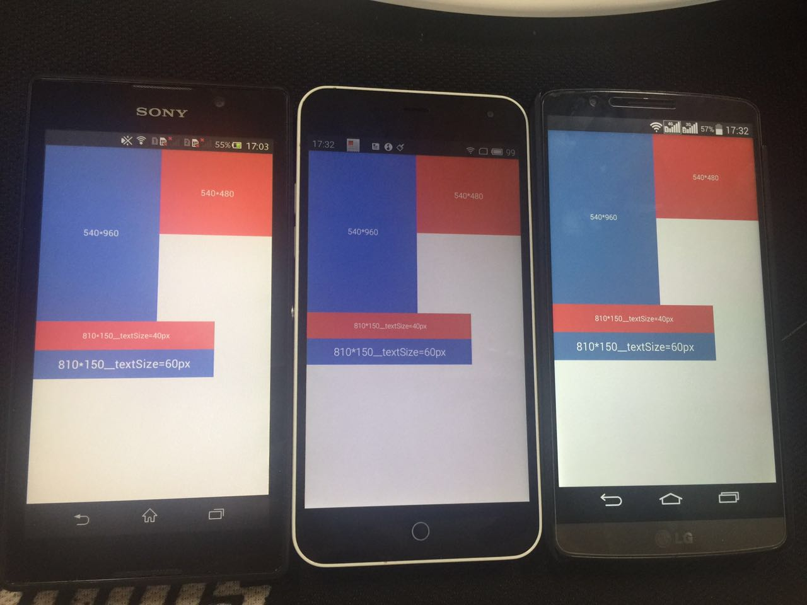
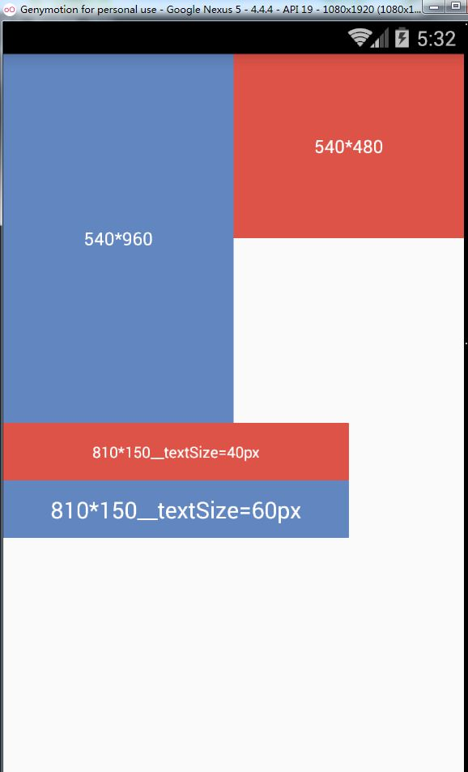

# AutoDimens  
布局适配  自动生成&lt;values-heightxwidth>的插件

## 预览
图片中,依次为

1.sony S39h(854x480)

2.魅蓝1(1280x768)

3.LG G3(2560x1440  2K屏幕)

4.模拟器Nexus5(1920x1080,demo中的基准分辨率)



## 使用

基于这篇[文章](http://blog.csdn.net/lmj623565791/article/details/45460089)编写,通过对基准设计文件的分辨率 进行适当的一定比例的倍增或倍减

通过```gralde插件```的方式自动生成values文件 进行适配

### 1.[(demo)](https://github.com/Vinctor/AutoDimens/blob/master/build.gradle)在项目根目录中```build.gradle```文件中添加

>classpath: classpath "com.vinctor:autoDimens:x.y.z"

 
 
### 2.在```applicaion```module中添加

>apply plugin: 'autodimens'

### 3.[(demo)](https://github.com/Vinctor/AutoDimens/blob/master/app/build.gradle)配置:可选配置项为:
在根```build.gradle```中添加配置参数:

     ext {
         maxPx = 2000
         standard = [1080, 1920]
         extra = [[768, 1280]]
         useDeviceSize = false
     }
     
#### maxPx

dimen的最大值,默认为```100```

#### standard

基准分辨率(美工切图上的分辨率),默认为```[1080, 1920]```,格式为```[宽,高]```

#### extra

你自己需要额外适配添加的分辨率.已内置的分辨率为:

        [320, 480]
        [480, 800]
        [480, 854]
        [540, 888]
        [540, 960]
        [768, 1024]
        [768, 1280]
        [720, 1280]
        [720, 1184]
        [720, 1280]
        [800, 1280]
        [1080, 1776]
        [1080, 1812]
        [1080, 1920]
        [1440, 2560]
        
 如果没有需要适配额外的分辨率,可自行添加,格式为```[[宽1,高1],[宽2,高2],……]```

#### useDeviceSize
设定是否使用全屏的高度,

即true:使用全屏高度;false:不使用全屏高度,排除虚拟键

(虚拟键高度设定约为全屏高度的1/10) 

默认为```false'''

### 4.生成资源文件

方法一:在```Terminal```中执行命令:

>gradlew autodimens

(mac下为```./gradlew autodimens```,如遇到mac权限拒绝,执行命令```chmod +x gradlew```)

方法二:找到```Gradle```选项卡

在你的```application```中找到:```Tasks>other>autoDimens```,双击执行```autoDimens```即可


